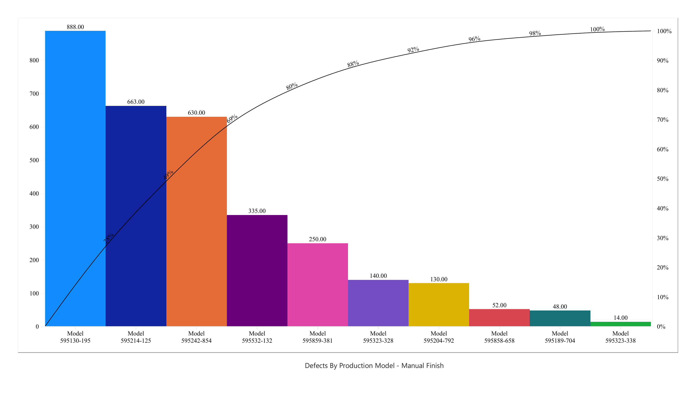
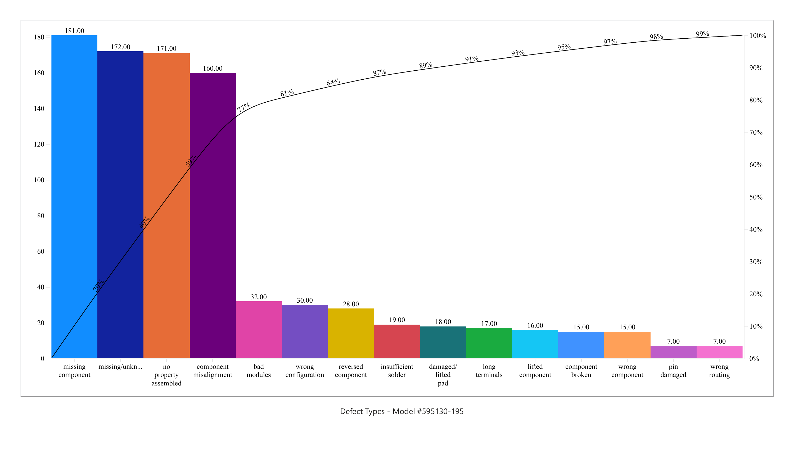
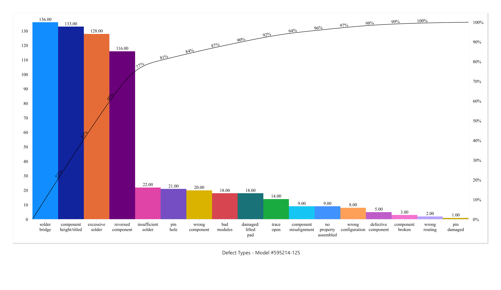
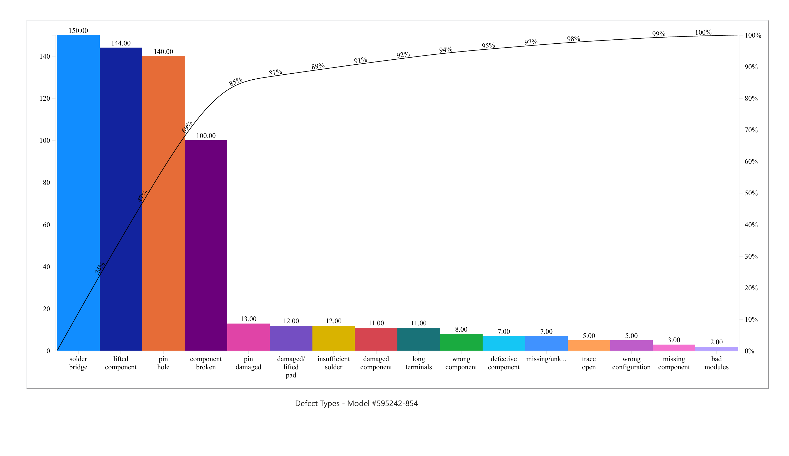

# Manufacturing Defect Analysis with Power BI

**DeVante Bowen | Academic case study | SNHU DAT 475 Applied Data Analysis**

I analyzed 3,150 manufacturing defect records across 52 inspection weeks to identify which electronic board models and defect categories should be investigated first. Using Power BI Pareto charts and a cause-and-effect fishbone diagram, I developed recommendations for a focused process improvement investigation.

**Key finding:** Three models accounted for **69.2% of recorded defects**, and two models accounted for **94.1% of solder bridges**.

## Business problem

The case describes a manufacturing facility in Tijuana, Mexico, where increased demand coincides with assembly and soldering defects in the Manual Finish area. Components are placed on boards, secured in fixtures, processed through wave soldering, inspected, and transferred for further assembly. Defects found after final assembly create costly rework and consume skilled labor.

The case goals are a **20% reduction in welding defects** and a **20% increase in production capacity without increasing the defect percentage**. These are proposed improvement goals, not results achieved by this analysis.

## Tools and methods

- **Power BI and Pareto+**: defect counts, model filters, descending frequency charts, and cumulative percentages.
- **Pareto analysis**: prioritization of models and defect categories.
- **Fishbone analysis**: organization of potential causes under People, Machines, Materials, Methods, Measurement, and Environment.
- **Microsoft Word**: preliminary findings report and production-line comparison.
- **Python standard library**: supplemental reproducibility script included with this repository. It verifies counts and exports summary tables; the project charts were created in Power BI.

## Data

The course-provided dataset contains **3,150 rows, 10 columns, and 10 production models**, covering inspection weeks **2025-W01 through 2025-W52**. Fields include model, version, defect type, observation area, QA worker, shift, component category, fixture, week, and order priority.

Each row is treated as a recorded defect observation. The dataset does not provide unique board identifiers or production-volume denominators, so the analysis does not equate records with unique defective boards or calculate defect rates.

## Findings

### Priority models

| Model | Recorded defects | Share of all defects |
|---|---:|---:|
| 595130-195 | 888 | 28.2% |
| 595214-125 | 663 | 21.0% |
| 595242-854 | 630 | 20.0% |
| **Combined** | **2,181** | **69.2%** |

These three models represent the largest recorded defect burden. Production volumes would be needed to determine whether they also have the highest defect rates.

### Leading defects within each model

| Model | Three leading recorded categories | Combined share within model |
|---|---|---:|
| 595130-195 | Missing component (181); missing/unknown (172); no property assembled (171) | 59.0% |
| 595214-125 | Solder bridge (136); component height/titled (133); excessive solder (128) | 59.9% |
| 595242-854 | Solder bridge (150); lifted component (144); pin hole (140) | 68.9% |

Labels such as `no property assembled` and `component height/titled` are preserved as supplied. They need clarification before reclassification or corrective action.

Across the full dataset, the largest recorded categories are solder bridge (304), no property assembled (272), and missing/unknown (239). Models 595214-125 and 595242-854 account for 286 of the 304 solder bridges, making them priorities for a shared investigation.

### Production-line comparison

Production Lines 1, 2, and 3 have 542, 527, and 544 observations, respectively. The small count differences do not establish one line as the main source. In addition, 525 records (16.7%) have an unknown observation area. An observation location identifies where a defect was detected, not necessarily where it originated.

## Recommendations

1. Review component placement, seating, orientation, and pre-solder verification on the three priority models.
2. Investigate fixture condition and wave soldering settings for the two models responsible for most solder bridges.
3. Standardize ambiguous defect categories and require a known observation area where possible.
4. Link observations to source line, board or batch, inspection stage, and production volume.
5. Pilot evidence-supported changes and compare weekly defect measures, rework hours, first-pass acceptance, and output per production hour.

The fishbone diagram presents **potential causes to investigate**, not proven causal findings. No process changes were implemented or savings measured as part of this preliminary analysis.

## Power BI charts

### Model 595130-195

### Model 595214-125

### Model 595242-854

## Report and supporting files

- [Revised academic report with fishbone diagram](reports/Preliminary_Analysis.docx)
- [Four Power BI Pareto charts as a PDF](reports/Power_BI_Pareto_Charts.pdf)
- [Course dataset](data/manufacturing_defects.csv)
- [Reproducible summary script](src/analyze_defects.py)
- [Exported summary tables](results/)
- [Power BI field setup](POWER_BI_SETUP.md)

The report is the revised academic document supplied for this repository. The original `.pbix` file is not included because it was not supplied. The PNGs and PDF are static Power BI exports.

## Limitations and next steps

- Count rankings cannot establish defect rates without production or inspection volumes.
- Ambiguous labels and unknown areas limit attribution.
- The dataset cannot establish causal responsibility for a worker, fixture, shift, or line.
- The case describes increased defects and demand, but capacity changes cannot be measured with the supplied fields.
- Further work should validate classifications and test process hypotheses using better traceability and comparable production denominators.

## Sources and attribution

Southern New Hampshire University. *DAT 475 project case study* [Course handout] and *DAT 475 project data set* [Course dataset].

The handout credits Realyvásquez-Vargas, Arredondo-Soto, Carrillo-Gutiérrez, and Ravelo (2018), *Applying the Plan-Do-Check-Act (PDCA) cycle to reduce the defects in the manufacturing industry: A case study*. This project uses the supplied course materials and does not claim access to the manufacturer's live production systems. The course dataset's redistribution license was not specified in the supplied CSV; no blanket open-source license is assigned to those materials.
